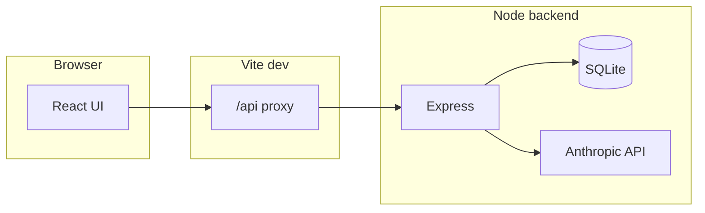

# Clapo

Track 3

**Policy, personalized:** a profile plus policy text → plain-language, structured impact analysis powered by the Anthropic Messages API.

> **Disclaimer:** Clapo is an educational / assistive tool. It does **not** provide legal, tax, or immigration advice. Verify outcomes with qualified professionals and official sources.

---

## Built with


Clapo is built with **JavaScript** (ES modules and JSX), **React** and **Vite** on the frontend, and **Node.js** with **Express** on the backend. Profiles live in a file-based **SQLite** database via **better-sqlite3**; policy analysis calls the **Anthropic Messages API** over HTTPS using **axios**. The browser extracts **.docx** text with **Mammoth** and **.pdf** text with **pdf.js** (`pdfjs-dist`). Configuration uses **dotenv**; the API enables **CORS** for local development. Everything runs locally with **npm**—no cloud service is required for the core stack.

---

## Inspiration

News and explainers rarely answer the question that matters most: **“What does this mean for *me*?”** Bills, agency rules, and workplace policy PDFs are long, dense, and written for a generic reader—not for someone with a specific state, income band, housing situation, or family structure.

Clapo exists to **close that gap**: put the person’s context first, then map policy language to **personalized, readable takeaways**—without replacing professional advice.

---

## What it does

1. **Profiles** — Users capture structured context (demographics, employment, housing, education signals, dependents, etc.) stored in **SQLite**.
2. **Policy input** — Users paste text or upload **`.txt`**, **`.docx`**, or **`.pdf`**; the browser extracts text where a text layer exists.
3. **Analysis** — The backend loads the profile, builds a **strict JSON-output prompt**, calls **Anthropic `POST /v1/messages`**, then **parses and validates** the model response before returning it to the UI.
4. **Results** — The UI shows a title, summary, overall impact level (**High / Medium / Low**), and themed **sections** (financial impact is always included; education, immigration, housing, employment, and business sections are **conditionally** requested based on profile-derived flags).

---

## How we built it

| Layer | Technology | Role |
|--------|------------|------|
| **Client** | React 19, Vite 8 | SPA: profile CRUD, uploads, client-side extraction, results |
| **API** | Express 5, `cors`, `express.json()` | REST: `/profiles`, `/analyze` |
| **Persistence** | SQLite via `better-sqlite3` | `backend/clapo.db`, prepared statements |
| **LLM** | Anthropic Messages API via `axios` | Prompt assembly, retry on model-ID 404, JSON post-processing |

- **Development networking:** Vite **`/api` proxy** to the Node server (`rewrite` strips `/api`) so the browser uses same-origin `fetch` to `/api/profiles` and `/api/analyze` without fragile CORS setups.
- **DOCX:** [`mammoth`](https://www.npmjs.com/package/mammoth) loaded via **dynamic `import()`** from `docxText.js`; Vite **pre-bundles** Mammoth-related CJS deps and sets `define.global` → `globalThis`.
- **PDF:** [`pdfjs-dist`](https://mozilla.github.io/pdf.js/) with a bundled **worker URL**; text via `getTextContent()` (no OCR—scanned PDFs stay empty unless the user pastes text).
- **Prompting:** `buildAnalyzePrompt()` embeds profile JSON and policy text; `computeAnalyzeFlags()` drives which optional sections the model must include or omit.
- **Resilience:** `parseClaudeJson()` tolerates markdown fences and extracts a balanced `{…}` object; `validateAnalyzePayload()` enforces a minimal schema; `CLAUDE_MODEL_FALLBACK` handles **model-not-found** responses from Anthropic.



**Repository layout (high level)**

```
backend/index.js    # routes, Claude client, parse/validate
backend/db.js       # schema + DB handle
frontend/src/       # pages, api.js, Analyze.jsx, docxText.js
```

---

## Challenges we ran into

- **Dev proxy & “Not Found”** — The frontend must be opened through **Vite’s dev server** so `/api` is proxied; hitting the static build or wrong port breaks `fetch` paths.
- **Mammoth + Vite** — CommonJS / mixed ESM required **`optimizeDeps`**, **`transformMixedEsModules`**, and **`global` → `globalThis`** so DOCX extraction works reliably in the browser.
- **PDF reality** — Many PDFs are **image-only**; `pdfjs-dist` only reads embedded text. Users need paste or external OCR for scans.
- **Model availability** — Anthropic model IDs vary by account; we added a **fallback model ID** and retry when the API returns a model-related **404**.
- **Secrets & lifecycle** — `CLAUDE_API_KEY` is only read **at process start**; missing keys, stray quotes/BOMs, or forgetting to **restart** after editing `.env` surfaced as opaque **401** errors until we normalized and clarified error messages server-side.
- **Ports** — Default backend port moved to **3001** to reduce collisions (e.g. with macOS services on **5000**).

---

## Accomplishments that we're proud of

- **End-to-end personalization** — Profile data actually changes which analysis sections the model is allowed to return, not just the wording.
- **Strict structured output** — Server-side JSON extraction and validation so the UI gets a predictable shape even when the model is chatty.
- **Real document workflows** — In-browser **DOCX** and **PDF** text extraction with honest UX for edge cases (empty PDF text layer).
- **Small, inspectable stack** — SQLite file DB, a single Express app, no heavy framework on the API—easy to run locally and reason about.
- **Smoke verification** — `backend/scripts/verify-backend.mjs` exercises the HTTP surface against a running server.

---

## What we learned

- **LLM outputs are messy** — Defensive parsing (fences, brace matching, fallbacks) matters as much as the prompt.
- **Browser bundling is part of the product** — “It works in Node” ≠ “it works in Vite”; third-party doc libraries need explicit build config.
- **Environment parity** — Same-origin proxying in dev avoids a whole class of CORS and “wrong base URL” bugs.
- **User-visible limits should be explicit** — Scanned PDFs and legacy **`.doc`** files are common failure modes; stating them upfront saves confusion.

---

## What's next for Clapo

- **Auth & multi-user** — Replace single-machine SQLite assumptions with accounts and optional hosted DB.
- **OCR or server-side PDF** — Optional pipeline for scanned documents (trade-offs: cost, latency, privacy).
- **Caching & rate limits** — Hash policy text + profile version to avoid repeat calls; protect the Anthropic key.
- **Source attribution & citations** — Link model claims back to spans in the uploaded policy where possible.
- **Accessibility & i18n** — Screen-reader polish, language/locale-aware prompts.
- **Deployment** — Containerized backend, CDN-hosted `frontend/dist`, secrets via platform env—not committed `.env`.

---

## Appendix: Local setup & API

### Prerequisites

- Node.js (LTS) and npm  
- [Anthropic API key](https://console.anthropic.com/settings/keys)

### Environment (`backend/.env`)

| Variable | Required | Notes |
|----------|----------|--------|
| `CLAUDE_API_KEY` | Yes | `sk-ant-api03-…`; one line, no quotes; restart server after edits. |
| `PORT` | No | Default **3001**. |
| `CLAUDE_MODEL` / `CLAUDE_MODEL_FALLBACK` | No | See `backend/.env.example`. |

Optional frontend: `VITE_API_PROXY_TARGET` (proxy upstream), `VITE_API_BASE` (default `/api`).

### Commands

```bash
# Backend
cd backend && cp .env.example .env && npm install && npm start

# Frontend (separate terminal)
cd frontend && npm install && npm run dev

# From repo root — backend only
npm start
```

Health: `GET http://127.0.0.1:3001/` → `Backend running` (adjust port if needed).

### REST (summary)

| Method | Path | Purpose |
|--------|------|---------|
| `GET` | `/profiles` | List profiles |
| `POST` | `/profiles` | Create profile (JSON body → SQLite) |
| `POST` | `/analyze` | `{ "profile_id", "policy_text" }` → structured analysis JSON |

Dev base path via Vite: **`/api`**. Errors: `400` / `404` / `502` with `{ error, detail? }` on analysis failures.

### Verify

```bash
cd backend && BASE=http://127.0.0.1:3001 node scripts/verify-backend.mjs
```

Uses Anthropic quota.

### Production frontend

```bash
cd frontend && npm run build
```

Serve `frontend/dist/`; set `VITE_API_BASE` at build time if the API is on another origin.

### License

See `backend/package.json` and `frontend/package.json`.
